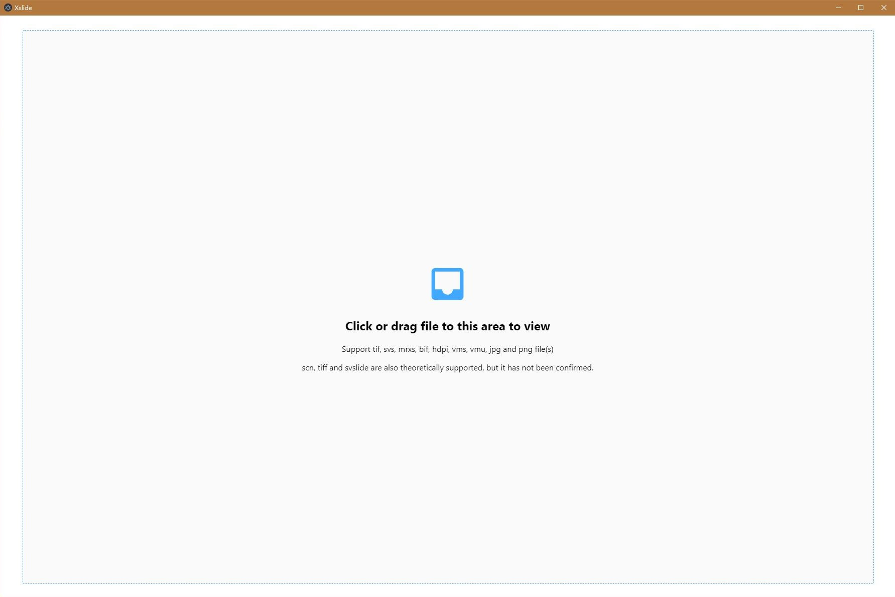

# Xslide

An application that can quickly view large images like .tif, .svs, .bif, .hdpi, .vms and .mrxs file(s).

## Screenshot

## Credits

Xslide would not exist without them:

[libvips](https://libvips.github.io/libvips/)
- A fast image processing library with low memory needs.

[electron](https://electronjs.org/)
- Build cross platform desktop apps with JavaScript, HTML, and CSS

## TODO

[] adapt MacOS

[] adapt Linux
